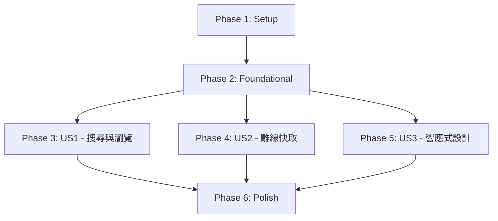

# Tasks: 技術棧現代化重構

**Input**: Design documents from `/specs/001-1-typescript-tailwindcss/`
**Prerequisites**: plan.md, spec.md, research.md, data-model.md, contracts/

**Tests**: 根據 spec.md Functional Requirements (FR-011, FR-012, FR-013)，本次重構包含完整測試：單元測試（Vitest）、整合測試（Testing Library）、E2E 測試（Playwright），目標覆蓋率 80% 以上。

**TDD Workflow**: 所有實作任務遵循 Test-Driven Development (TDD) 原則：

1. **RED**: 先撰寫測試（應該失敗）
2. **GREEN**: 實作功能（讓測試通過）
3. **REFACTOR**: 重構程式碼（保持測試通過）

對於核心業務邏輯（services, features/slices, hooks, utilities），任務拆分為：

- **[TEST]** 任務：撰寫測試檔案（例如 `T025a [TEST]`）
- **[IMPL]** 任務：實作功能（例如 `T025b [IMPL]`）

測試任務必須在對應的實作任務之前完成。

**Organization**: 任務按使用者故事組織，每個故事可獨立實作與驗證。

## Format: `[ID] [P?] [Story] Description`

- **[P]**: 可平行執行（不同檔案、無依賴）
- **[Story]**: 所屬使用者故事（US1, US2, US3）
- 描述中包含精確檔案路徑

## Path Conventions

本專案為單一 Web 應用（SPA），檔案路徑：

- 原始碼：`src/`
- 公開資源：`public/`
- 設定檔：專案根目錄
- 規格文件：`specs/001-1-typescript-tailwindcss/`

---

## Phase 1: Setup (Shared Infrastructure)

**Purpose**: 專案初始化與基礎架構建立

- [x] **T001** 建立專案目錄結構（按照 plan.md 的 Project Structure）

  - 建立 `src/app/`, `src/features/`, `src/components/`, `src/services/`, `src/hooks/`, `src/lib/`, `src/types/`, `src/styles/`
  - 建立 `public/data/` 目錄

- [x] **T002** 初始化 TypeScript + React + Vite 專案

  - 安裝 React 19.2.0, TypeScript 5.x, Vite 7.x
  - 建立 `package.json` 與基本腳本（dev, build, preview, type-check, lint）

- [x] **T003** [P] 配置 TypeScript 編譯器

  - 建立 `tsconfig.json`（strict mode, paths alias `@/*` → `src/*`）
  - 設定 target: ES2020, module: ESNext, jsx: react-jsx

- [x] **T004** [P] 配置 ESLint + typescript-eslint

  - 建立 `eslint.config.js`（ESLint 9.x flat config）
  - 安裝 @typescript-eslint/parser, @typescript-eslint/eslint-plugin
  - 設定規則：no-unused-vars, no-console (warn), consistent-return

- [x] **T005** [P] 配置 Tailwind CSS 4.x

  - 安裝 `tailwindcss@next`, `@tailwindcss/vite`
  - 建立 `src/styles/globals.css`（`@import "tailwindcss"` + `@theme` 指令）
  - 設定 Spotify 主題配色（根據 research.md 的 oklch 色彩方案）

- [x] **T006** [P] 配置 Vite

  - 建立 `vite.config.ts`
  - 配置 `@vitejs/plugin-react`, `@tailwindcss/vite`
  - 設定路徑別名 `@` → `src`
  - 配置 build.rollupOptions 用於 code splitting

- [x] **T007** [P] 安裝 shadcn/ui 基礎設定

  - 安裝 `@radix-ui/react-*` 相關套件
  - 建立 `src/lib/utils.ts`（cn helper function）
  - 建立 `src/components/ui/` 目錄

- [x] **T008** [P] 安裝核心依賴

  - Redux Toolkit 2.x: `@reduxjs/toolkit`, `react-redux`
  - Recharts 3.x: `recharts`
  - Fuse.js 7.x: `fuse.js`
  - Zod: `zod`
  - Date-fns 或 Day.js（時間格式化）

- [x] **T009** 建立環境變數範本

  - 建立 `.env.example`（包含 `VITE_SPOTIFY_CLIENT_ID`, `VITE_SPOTIFY_CLIENT_SECRET`）
  - 更新 `.gitignore`（排除 `.env.local`）

- [x] **T010** 建立基本型別定義

  - 建立 `src/types/index.ts`（匯出所有型別）
  - 複製 `specs/001-1-typescript-tailwindcss/contracts/spotify-api.ts` 至 `src/types/spotify.ts`
  - 複製 `specs/001-1-typescript-tailwindcss/contracts/tracks-data-schema.ts` 至 `src/types/data-schema.ts`

- [x] **T011** [P] 配置測試框架

  - 安裝 Vitest + @vitest/ui (單元測試 & 整合測試)
  - 安裝 @testing-library/react + @testing-library/user-event (React 元件測試)
  - 安裝 @playwright/test (E2E 測試)
  - 建立 `vitest.config.ts`（設定 coverage, globals, setupFiles）
  - 建立 `playwright.config.ts`（設定 baseURL, browsers）
  - 建立 `tests/setup.ts`（全域測試設定）
  - 新增 `package.json` scripts: `test`, `test:ui`, `test:coverage`, `test:e2e`

- [x] **T012** [P] 建立測試工具與 Mocks
  - 建立 `tests/mocks/spotify-api.mock.ts`（Spotify API Mock 資料）
  - 建立 `tests/mocks/tracks-data.mock.ts`（本地資料庫 Mock）
  - 建立 `tests/utils/test-utils.tsx`（自訂 render function with Redux Provider）
  - 建立 `tests/utils/mock-store.ts`（Redux store mock factory）

---

## Phase 2: Foundational (Blocking Prerequisites)

**Purpose**: 核心基礎設施，所有使用者故事開始前必須完成

**⚠️ CRITICAL**: 此階段完成前，無法開始任何使用者故事實作

- [x] **T013** 建立 Redux Store 配置

  - 建立 `src/app/store.ts`
  - 配置 `configureStore`，設定 middleware（處理 Fuse.js 不可序列化）
  - 匯出 `RootState`, `AppDispatch`, `useAppDispatch`, `useAppSelector` typed hooks

- [x] **T014** [P] 建立 Artist Redux Slice 骨架

  - 建立 `src/features/artist/artist-slice.ts`（初始 state、reducers 骨架）
  - 建立 `src/features/artist/artist-types.ts`（ArtistState 介面）
  - 建立 `src/features/artist/artist-selectors.ts`（selectCurrentArtist, selectArtistLoading）

- [x] **T015** [P] 建立 Track Redux Slice 骨架

  - 建立 `src/features/track/track-slice.ts`
  - 建立 `src/features/track/track-types.ts`（TrackState 介面）
  - 建立 `src/features/track/track-selectors.ts`（selectCurrentTrack, selectTrackLoading）

- [x] **T016** [P] 建立 Search Redux Slice 骨架

  - 建立 `src/features/search/search-slice.ts`
  - 建立 `src/features/search/search-types.ts`（SearchState 介面，包含 fuseInstance）
  - 建立 `src/features/search/search-selectors.ts`（selectSearchResults, selectSearchQuery）

- [x] **T017** [P] 建立 Data Redux Slice 骨架

  - 建立 `src/features/data/data-slice.ts`（管理資料載入狀態）
  - 建立 `src/features/data/data-types.ts`（DataState 介面）
  - 建立 `src/features/data/data-selectors.ts`（selectDataLoaded, selectDataLoading, selectTracks）

- [x] **T018** [P] 建立 Spotify Redux Slice 骨架

  - 建立 `src/features/spotify/spotify-slice.ts`（管理 Spotify API token）
  - 建立 `src/features/spotify/spotify-types.ts`（SpotifyState 介面）
  - 建立 `src/features/spotify/spotify-selectors.ts`（selectSpotifyToken, selectTokenValid）

- [x] **T019** 整合所有 Redux Slices 至 Store

  - 在 `src/app/store.ts` 中匯入所有 reducers
  - 配置 reducer 組合：`{ artist, track, search, data, spotify }`
  - 驗證 store 可正常初始化

- [x] **T020** 實作 Spotify API Service（骨架）

  - 建立 `src/services/spotify-api.ts`
  - 實作 `SpotifyApiService` class（實作 `ISpotifyApiService` 介面）
  - 實作 `initialize()` 方法（Client Credentials Flow，使用環境變數）
  - 實作 `isTokenValid()`, `refreshToken()` 方法
  - 匯出 singleton instance: `export const spotifyApi = new SpotifyApiService()`

- [ ] **T021** 實作資料載入 Service（骨架）

  - 建立 `src/services/data-loader.ts`
  - 實作 `loadTracksDatabase()` 函數（fetch `/data/tracks.json`）
  - 實作資料驗證（使用 Zod schema from `src/types/data-schema.ts`）
  - 實作 `checkDataIntegrity()` 呼叫

- [ ] **T022** 實作 sessionStorage Service

  - 建立 `src/services/storage.ts`
  - 實作 `StorageService` class：
    - `saveTracksData(data)` - 儲存至 sessionStorage
    - `loadTracksData()` - 從 sessionStorage 讀取
    - `clearTracksData()` - 清除快取
    - `getDataVersion()` - 取得快取版本
  - 處理 quota exceeded 錯誤（降級為記憶體儲存）

- [ ] **T023** 建立基礎 shadcn/ui 元件

  - 建立 `src/components/ui/button.tsx`（使用 Radix UI Slot）
  - 建立 `src/components/ui/card.tsx`
  - 建立 `src/components/ui/skeleton.tsx`
  - 建立 `src/components/ui/spinner.tsx`（Loading 動畫）
  - 所有元件使用 Tailwind CSS 4.x + Spotify 主題

- [ ] **T024** 建立工具函式

  - 建立 `src/lib/formatters.ts`：
    - `formatNumber(num)` - 數字千分位格式化（1,000,000）
    - `formatDuration(ms)` - 時長格式化（3:45）
    - `formatDate(date)` - 日期格式化
  - 建立 `src/lib/constants.ts`：
    - `SEARCH_LIMIT = 12`
    - `DATA_VERSION = "2023.1"`
    - Spotify API endpoints

- [ ] **T025** 建立應用進入點

  - 建立 `src/main.tsx`（React root render，strict mode）
  - 建立 `src/app/App.tsx`（基本骨架，使用 Redux Provider）
  - 在 `public/index.html` 中匯入 `src/main.tsx`

- [ ] **T026** 建立錯誤邊界元件
  - 建立 `src/components/error-boundary.tsx`（React Error Boundary）
  - 顯示友善錯誤訊息與重試按鈕
  - 整合至 `App.tsx`

**Checkpoint**: 基礎設施完成 - 可開始實作使用者故事（各故事可平行進行）

---

## Phase 3: User Story 1 - 藝人搜尋與歌曲瀏覽 (Priority: P1) 🎯 MVP

**Goal**: 使用者可搜尋藝人、查看藝人資訊與歌曲清單、點擊歌曲查看詳細資訊與圖表

**Independent Test**:

1. 開啟應用，輸入 "Gorillaz" 搜尋
2. 點擊結果，查看藝人頭像、追蹤數、歌曲清單
3. 點擊 "Feel Good Inc."，查看歌曲封面、人氣圖表、音樂特徵圖表
4. 整個流程應在 30 秒內完成（假設資料已載入）

### Implementation for User Story 1

#### T025-T030: 資料載入與搜尋引擎 (US1 核心依賴)

- [ ] **T027** [US1] 實作資料載入邏輯（Data Slice）

  - 在 `src/features/data/data-slice.ts` 新增 `loadLocalData` async thunk
  - 呼叫 `data-loader.ts` 的 `loadTracksDatabase()`
  - 載入成功後儲存至 Redux state (`tracks` array)
  - 處理載入失敗（顯示錯誤）

- [ ] **T028** [US1] 整合 sessionStorage 快取至資料載入

  - 在 `loadLocalData` thunk 中，先檢查 sessionStorage
  - 若快取存在且版本正確，直接使用快取
  - 若快取不存在或版本過期，下載並快取至 sessionStorage
  - 更新 Data Slice 的 loading 狀態

- [ ] **T029** [US1] 實作 Fuse.js 搜尋引擎服務

  - 建立 `src/features/search/search-service.ts`
  - 實作 `createSearchIndex(tracks)` 函數（回傳 Fuse instance）
  - 配置 Fuse.js 選項：
    - `keys: ['artistName']`
    - `threshold: 0.3`（模糊匹配）
    - `includeScore: true`
  - 實作 `searchArtists(fuse, query, limit = 12)` 函數

- [ ] **T030** [US1] 整合搜尋引擎至 Search Slice

  - 在 `src/features/search/search-slice.ts` 新增 `initializeSearch` reducer
  - 接收 Fuse instance 並儲存至 state（標記為不可序列化）
  - 新增 `performSearch` reducer（接收 query，呼叫 `searchArtists`，更新 results）
  - 新增 `clearSearch` reducer

- [ ] **T031** [US1] 實作資料載入 Hook

  - 建立 `src/hooks/use-data-loader.ts`
  - 在 component mount 時 dispatch `loadLocalData`
  - 資料載入成功後 dispatch `initializeSearch`（建立 Fuse index）
  - 回傳 `{ dataLoaded, dataLoading, error }`

- [ ] **T032** [US1] 建立 Loading 畫面元件
  - 建立 `src/components/layout/loading-fallback.tsx`
  - 顯示 Spinner + 載入訊息（"載入音樂資料庫..."）
  - 顯示 Dashboard Skeleton 預覽（根據 research.md 設計）
  - 使用 Spotify 主題配色

#### T031-T036: Spotify API 整合 (US1 即時資料)

- [ ] **T033** [P] [US1] 實作 Spotify API - getArtist

  - 在 `src/services/spotify-api.ts` 實作 `getArtist(artistId)` 方法
  - 呼叫 `GET https://api.spotify.com/v1/artists/{id}`
  - 使用 token（from Redux store）
  - 處理錯誤（401, 429, 404）→ 拋出 `SpotifyApiError`
  - 驗證回應（使用 type guard `isValidSpotifyArtist`）

- [ ] **T034** [P] [US1] 實作 Spotify API - getTrack

  - 在 `src/services/spotify-api.ts` 實作 `getTrack(trackId)` 方法
  - 呼叫 `GET https://api.spotify.com/v1/tracks/{id}`
  - 驗證回應（使用 `isValidSpotifyTrack`）

- [ ] **T035** [P] [US1] 實作 Spotify API - getAudioFeatures

  - 在 `src/services/spotify-api.ts` 實作 `getAudioFeatures(trackId)` 方法
  - 呼叫 `GET https://api.spotify.com/v1/audio-features/{id}`
  - 驗證回應（使用 `isValidAudioFeatures`）

- [ ] **T036** [US1] 整合 getArtist 至 Artist Slice

  - 在 `src/features/artist/artist-slice.ts` 新增 `fetchArtist` async thunk
  - 呼叫 `spotifyApi.getArtist(artistId)`
  - 成功後更新 state (`currentArtist`)
  - 處理錯誤（儲存 error message）

- [ ] **T037** [US1] 整合 getTrack 至 Track Slice

  - 在 `src/features/track/track-slice.ts` 新增 `fetchTrackDetails` async thunk
  - 呼叫 `spotifyApi.getTrack(trackId)`
  - 提取專輯資訊（album name, cover URL, release date）
  - 更新 `currentTrack.album` 欄位

- [ ] **T038** [US1] 整合 getAudioFeatures 至 Track Slice
  - 在 `src/features/track/track-slice.ts` 新增 `fetchAudioFeatures` async thunk
  - 呼叫 `spotifyApi.getAudioFeatures(trackId)`
  - 更新 `currentTrack.features` 欄位
  - 可與 `fetchTrackDetails` 平行執行

#### T037-T042: 搜尋 UI 元件

- [ ] **T039** [P] [US1] 建立搜尋列元件

  - 建立 `src/components/search/search-bar.tsx`
  - 使用 shadcn/ui Input 元件
  - 即時搜尋（debounce 300ms）
  - dispatch `performSearch` action
  - 顯示搜尋 icon（magnifying glass）

- [ ] **T040** [P] [US1] 建立搜尋結果元件

  - 建立 `src/components/search/search-results.tsx`
  - 顯示藝人清單（最多 12 筆）
  - 每項顯示藝人名稱 + 人氣度（從本地資料）
  - 點擊藝人 → dispatch `setCurrentArtist` + navigate
  - 無結果時顯示「查無相關藝人」

- [ ] **T041** [US1] 實作搜尋 Hook

  - 建立 `src/hooks/use-search.ts`
  - 整合 `useAppSelector(selectSearchResults)`, `useAppDispatch`
  - 提供 `search(query)` 函數
  - 回傳 `{ results, searching, search, clearSearch }`

- [ ] **T042** [US1] 建立 Header 布局元件

  - 建立 `src/components/layout/header.tsx`
  - 包含應用 Logo（"Spotify YouTube Hits"）
  - 嵌入 `SearchBar` 元件
  - 使用 Spotify 主題（深黑背景 #121212）

- [ ] **T043** [US1] 建立 Dashboard 布局元件

  - 建立 `src/components/layout/dashboard-layout.tsx`
  - 結構：`<Header />` + 主內容區域
  - 主內容區域使用 CSS Grid（響應式，稍後 US3 擴展）
  - 目前桌面版：左側 Sidebar（40%），右側 Main（60%）

- [ ] **T044** [US1] 建立 Sidebar 布局元件
  - 建立 `src/components/layout/sidebar.tsx`
  - 結構：上方藝人資訊 + 下方歌曲清單
  - 使用 Card 元件包裝

#### T043-T048: 藝人與歌曲 UI 元件

- [ ] **T045** [P] [US1] 建立藝人資料卡元件

  - 建立 `src/components/artist/artist-profile.tsx`
  - 接收 `SpotifyArtist` props
  - 顯示：藝人頭像（Avatar）、名稱（h2）、追蹤人數、人氣度（progress bar）
  - 使用 shadcn/ui Card

- [ ] **T046** [P] [US1] 建立歌曲清單元件

  - 建立 `src/components/track/track-list.tsx`
  - 接收 `tracks[]` props（來自本地資料，filtered by artistId）
  - 每項顯示：歌曲名稱、發行年份、人氣度（Spotify + YouTube 綜合）
  - 點擊歌曲 → dispatch `setCurrentTrack` + fetch API data
  - 使用虛擬滾動（若歌曲 > 50 首）

- [ ] **T047** [US1] 建立歌曲詳情卡元件

  - 建立 `src/components/track/track-detail.tsx`
  - 接收 `Track` props（包含 album, features）
  - 顯示：歌曲封面（album.coverUrl）、名稱、藝人、專輯、發行年份、時長
  - 使用 Grid 布局（左側封面、右側資訊）

- [ ] **T048** [P] [US1] 建立人氣圖表元件

  - 建立 `src/components/track/popularity-chart.tsx`
  - 使用 Recharts BarChart
  - X 軸：平台（Spotify, YouTube Views, YouTube Likes, YouTube Comments）
  - Y 軸：數值（使用 log scale）
  - 使用 shadcn/ui Chart wrapper + Spotify 配色

- [ ] **T049** [P] [US1] 建立音樂特徵圖表元件

  - 建立 `src/components/track/feature-chart.tsx`
  - 使用 Recharts RadarChart
  - 顯示 7 個指標：acousticness, danceability, energy, instrumentalness, liveness, speechiness, valence
  - 所有數值 normalized to 0-1
  - 使用 Spotify Green 填充

- [ ] **T050** [US1] 實作 Artist Hook

  - 建立 `src/hooks/use-artist.ts`
  - 接收 `artistId`
  - dispatch `fetchArtist` thunk
  - 回傳 `{ artist, loading, error }`

- [ ] **T051** [US1] 實作 Track Hook
  - 建立 `src/hooks/use-track.ts`
  - 接收 `trackId`
  - 平行 dispatch `fetchTrackDetails` 與 `fetchAudioFeatures`
  - 回傳 `{ track, loading, error }`

#### T050-T052: 整合與路由

- [ ] **T052** [US1] 整合所有元件至 App.tsx

  - 更新 `src/app/App.tsx`：
    - 使用 `useDataLoader` Hook（顯示 LoadingFallback）
    - 資料載入完成後顯示 `<DashboardLayout>`
    - Sidebar 包含 `<ArtistProfile>` + `<TrackList>`
    - Main 包含 `<TrackDetail>` + Charts
  - 使用 Redux selectors 取得 currentArtist, currentTrack

- [ ] **T053** [US1] 實作狀態管理邏輯

  - 搜尋結果點擊 → 更新 Redux `currentArtist` → 觸發 `fetchArtist` → 顯示藝人資訊
  - 藝人確認後 → 過濾歌曲（從本地資料）→ 顯示 TrackList
  - 歌曲點擊 → 更新 Redux `currentTrack` → 平行 fetch track details + audio features → 顯示圖表

- [ ] **T054** [US1] 處理錯誤情境
  - Spotify API 401 → 自動 refreshToken
  - Spotify API 429 → 顯示「伺服器忙碌中」Toast
  - Spotify API 404 → 顯示「查無此資料」
  - 網路中斷（資料載入時）→ 顯示錯誤訊息 + 重試按鈕

**Checkpoint**: User Story 1 完成 - 核心搜尋與瀏覽功能可正常運作

---

## Phase 4: User Story 2 - 離線資料緩存與快速載入 (Priority: P2)

**Goal**: 優化資料載入效能，支援離線使用

**Independent Test**:

1. 首次開啟應用，觀察 Network 面板確認下載 tracks.json
2. 關閉網路連線，重新整理頁面
3. 驗證應用仍可正常運作（搜尋、切換歌曲）
4. 重新開啟網路，關閉分頁後再開啟，驗證使用快取（無重新下載）

### Implementation for User Story 2

**註**：US2 的基礎設施大部分已在 Phase 2 建立（T020 sessionStorage Service, T026 快取整合），此階段主要是優化與擴展。

- [ ] **T055** [P] [US2] 實作載入進度指示器

  - 在 `src/components/layout/loading-fallback.tsx` 新增進度條
  - 使用 `fetch` 的 `ReadableStream` 追蹤下載進度
  - 顯示百分比（0-100%）+ 當前狀態（"下載中...", "驗證中...", "建立索引..."）

- [ ] **T056** [P] [US2] 實作資料版本管理

  - 在 `src/services/storage.ts` 新增 `checkDataVersion()` 方法
  - 比對本地快取版本與遠端版本（從 tracks.json metadata）
  - 若版本不一致，提示使用者「資料已更新，是否重新載入？」（使用 Dialog）

- [ ] **T057** [US2] 優化 sessionStorage 策略

  - 實作降級方案：
    1. 優先使用 sessionStorage
    2. 若容量不足（QuotaExceededError），嘗試壓縮（使用 LZ-string）
    3. 若仍失敗，降級為記憶體儲存（Redux state only）
  - 在 console 顯示使用的儲存方式

- [ ] **T058** [US2] 實作離線模式偵測

  - 建立 `src/hooks/use-online-status.ts`
  - 監聽 `window.addEventListener('online')`, `window.addEventListener('offline')`
  - 回傳 `isOnline` boolean

- [ ] **T059** [US2] 整合離線模式 UI 提示

  - 在 `src/components/layout/header.tsx` 新增離線模式指示器
  - 當 `isOnline === false` 時，顯示黃色橫幅「離線模式：Spotify API 功能暫時無法使用」
  - 使用 shadcn/ui Alert 元件

- [ ] **T060** [US2] 優化 Spotify API 呼叫（離線處理）

  - 在 `src/services/spotify-api.ts` 所有方法中，先檢查 `navigator.onLine`
  - 若離線，不呼叫 API，直接回傳 cached data（若有）或跳過
  - 在 Artist/Track 元件中，顯示「離線模式：部分資訊無法更新」提示

- [ ] **T061** [US2] 實作資料完整性檢查 UI
  - 在資料載入後（`loadLocalData` success），呼叫 `checkDataIntegrity()`
  - 若發現問題（重複 ID、metadata 不一致），在 console.warn 顯示
  - 不阻止應用運作，但在開發模式顯示警告 Toast

**Checkpoint**: User Story 2 完成 - 資料快取與離線支援功能運作正常

---

## Phase 5: User Story 3 - 響應式設計與多裝置支援 (Priority: P3)

**Goal**: 支援手機、平板、桌面三種螢幕尺寸，自動調整布局

**Independent Test**:

1. 使用 Chrome DevTools，模擬 iPhone SE (375px)
2. 驗證搜尋列、藝人資訊、歌曲清單、歌曲詳情垂直排列
3. 切換至 iPad (768px)，驗證雙欄布局
4. 切換至 Desktop (1440px)，驗證左側固定寬度、右側自適應

### Implementation for User Story 3

**註**：Tailwind CSS 4.x Mobile First 已在 T005 配置，此階段主要是調整元件樣式。

- [ ] **T062** [US3] 優化 DashboardLayout 響應式布局

  - 在 `src/components/layout/dashboard-layout.tsx` 使用 Tailwind 斷點：
    - Mobile (< 768px): `flex flex-col`（垂直排列）
    - Tablet (768px - 1024px): `grid grid-cols-[40%_60%]`（雙欄）
    - Desktop (> 1024px): `grid grid-cols-[24rem_1fr]`（左側固定寬度）

- [ ] **T063** [P] [US3] 優化 Sidebar 響應式樣式

  - Mobile: 全寬（`w-full`）
  - Tablet/Desktop: 使用 Grid 控制寬度
  - 歌曲清單在 Mobile 顯示前 10 首 + "顯示更多" 按鈕

- [ ] **T064** [P] [US3] 優化 TrackDetail 響應式樣式

  - Mobile: 封面 + 資訊垂直排列（`flex flex-col`）
  - Tablet/Desktop: 封面 + 資訊水平排列（`flex flex-row`）
  - 封面大小：Mobile (120px), Tablet (180px), Desktop (240px)

- [ ] **T065** [P] [US3] 優化圖表響應式樣式

  - 在 `src/components/track/popularity-chart.tsx`:
    - Mobile: 圖表高度 200px，縮小字體
    - Tablet: 圖表高度 280px
    - Desktop: 圖表高度 360px
  - 在 `src/components/track/feature-chart.tsx`:
    - Mobile: Radar 圖半徑 60px
    - Desktop: Radar 圖半徑 100px

- [ ] **T066** [P] [US3] 優化 Header 響應式樣式

  - Mobile: Logo 縮小（text-lg）、搜尋列全寬
  - Desktop: Logo 正常大小（text-2xl）、搜尋列最大寬度 600px

- [ ] **T067** [P] [US3] 優化 SearchBar 響應式行為

  - Mobile: 點擊搜尋列時，自動展開（全螢幕 Overlay）
  - Desktop: 保持 inline 行為
  - 使用 shadcn/ui Dialog 元件（Mobile only）

- [ ] **T068** [US3] 實作超大螢幕限制

  - 在 `src/components/layout/dashboard-layout.tsx` 新增 `max-w-screen-2xl mx-auto`
  - 限制內容最大寬度 1920px，超過則置中顯示

- [ ] **T069** [US3] 處理裝置旋轉

  - 使用 CSS `@media (orientation: landscape)` 與 `@media (orientation: portrait)`
  - 手機橫向時，強制使用 Tablet 布局（雙欄）
  - 使用 `window.addEventListener('orientationchange')` 觸發重新渲染（若需要）

- [ ] **T070** [US3] 測試與微調
  - 使用 Chrome DevTools 測試所有斷點（375px, 768px, 1024px, 1440px, 2560px）
  - 驗證文字可讀性（字體大小 >= 14px）
  - 驗證觸控目標大小（按鈕 >= 44x44px）
  - 驗證無橫向滾動

**Checkpoint**: User Story 3 完成 - 響應式設計在所有裝置正常運作

---

## Phase 6: Polish & Cross-Cutting Concerns

**Purpose**: 跨故事的改進與最終優化

- [ ] **T071** [P] 建立 shadcn/ui Toast 元件

  - 建立 `src/components/ui/toast.tsx` 與 `src/components/ui/toaster.tsx`
  - 整合至 App.tsx（全域 Toast 容器）
  - 用於顯示錯誤、成功訊息

- [ ] **T072** [P] 優化圖表顏色與主題

  - 檢查所有圖表使用 Spotify 配色（Spotify Green #1DB954 作為 primary）
  - 統一圖表樣式（字體、網格線、tooltips）

- [ ] **T073** 實作鍵盤快捷鍵

  - `/` 鍵聚焦搜尋列
  - `Esc` 鍵清除搜尋
  - `↑↓` 鍵在搜尋結果中導航

- [ ] **T074** 優化效能

  - 檢查 Redux selectors 是否使用 Reselect memoization
  - 檢查 React 元件是否使用 `React.memo`（適用於 TrackListItem）
  - 使用 `React.lazy` + `Suspense` lazy load 圖表元件

- [ ] **T075** 新增 Meta tags

  - 在 `public/index.html` 新增 Open Graph tags（分享至社群媒體）
  - 新增 favicon（Spotify Green 音符 icon）
  - 新增 viewport meta tag（已在 T001 設定，檢查）

- [ ] **T076** [P] 程式碼品質檢查

  - 執行 `npm run type-check` - 確認無 TypeScript 錯誤
  - 執行 `npm run lint` - 修正所有 ESLint 警告
  - 檢查 console.log 移除（保留必要的 error/warn）

- [ ] **T077** [P] 文件更新

  - 更新 `README.md`（加入專案描述、截圖、執行指令）
  - 確認 `quickstart.md` 指令可正常執行
  - 新增 `CONTRIBUTING.md`（若團隊協作）

- [ ] **T078** 建置與部署測試

  - 執行 `npm run build` - 確認建置成功
  - 執行 `npm run preview` - 測試生產版本
  - 檢查 bundle size（主 bundle < 500KB gzip）
  - 部署至 GitHub Pages（或其他靜態主機）

- [ ] **T079** 最終驗收測試

  - 依序執行所有 User Story 的 Independent Test
  - US1: 搜尋 → 藝人 → 歌曲 → 圖表（30 秒內完成）
  - US2: 離線模式測試（關閉網路仍可運作）
  - US3: 三種螢幕尺寸測試（375px, 768px, 1440px）
  - 執行 `quickstart.md` 中的驗證清單

- [ ] **T080** [P] 建立專案英中雙語 README.md
  - 建立 `README.md`（英文版，專案根目錄）
  - 建立 `README.zh-TW.md`（繁體中文版）
  - 內容包含：
    - 專案簡介與截圖
    - 技術棧說明（TypeScript, Tailwind CSS 4.x, Redux Toolkit, shadcn/ui）
    - 功能特色（藝人搜尋、歌曲瀏覽、圖表視覺化、離線支援、響應式設計）
    - 安裝與執行指令（參考 quickstart.md）
    - 環境變數設定（Spotify API 金鑰）
    - 專案架構說明
    - 部署指南（GitHub Pages）
    - 授權資訊與貢獻指南
    - 語言切換連結（`[English](README.md) | [繁體中文](README.zh-TW.md)`）

---

## Dependencies & Execution Order

### Phase Dependencies



- **Setup (Phase 1)**: 無依賴 - 立即開始
- **Foundational (Phase 2)**: 依賴 Setup 完成 - **阻擋所有使用者故事**
- **User Stories (Phase 3-5)**: 全部依賴 Foundational 完成
  - US1, US2, US3 可平行進行（若有足夠人力）
  - 或依優先順序執行（P1 → P2 → P3）
- **Polish (Phase 6)**: 依賴所有使用者故事完成

### User Story Dependencies

- **User Story 1 (P1)**: Foundational 完成後可開始 - 無其他依賴
- **User Story 2 (P2)**: Foundational 完成後可開始 - 部分依賴 US1 的資料載入邏輯（T025-T026 已包含）
- **User Story 3 (P3)**: Foundational 完成後可開始 - 依賴 US1 的 UI 元件已建立

**建議執行順序**（單人開發）：Setup → Foundational → US1 → US2 → US3 → Polish

### Within Each User Story

- **US1**:

  1. T025-T030: 資料載入與搜尋引擎（核心依賴）
  2. T031-T036: Spotify API 整合（可與 T037-T042 平行）
  3. T037-T042: 搜尋 UI 元件（可與 T031-T036 平行）
  4. T043-T049: 藝人與歌曲 UI 元件（依賴 T031-T036 完成）
  5. T050-T052: 整合與錯誤處理（最後）

- **US2**:

  - T053-T059 可依序執行（T053, T054, T056 可平行）

- **US3**:
  - T060-T068 可平行執行（均為不同元件的樣式調整）

### Parallel Opportunities

#### Phase 1: Setup - 可平行執行

```bash
# 同時執行
T003 [P] 配置 TypeScript
T004 [P] 配置 ESLint
T005 [P] 配置 Tailwind CSS 4.x
T006 [P] 配置 Vite
T007 [P] 安裝 shadcn/ui
T008 [P] 安裝核心依賴
```

#### Phase 2: Foundational - 可平行執行

```bash
# Redux Slices 可平行建立
T012 [P] Artist Slice
T013 [P] Track Slice
T014 [P] Search Slice
T015 [P] Data Slice
T016 [P] Spotify Slice
```

#### Phase 3: US1 - 可平行執行

```bash
# Spotify API 方法可平行實作
T031 [P] getArtist
T032 [P] getTrack
T033 [P] getAudioFeatures

# UI 元件可平行建立
T037 [P] SearchBar
T038 [P] SearchResults
T043 [P] ArtistProfile
T044 [P] TrackList
T046 [P] PopularityChart
T047 [P] FeatureChart
```

#### Phase 4: US2 - 可平行執行

```bash
T053 [P] 載入進度指示器
T054 [P] 資料版本管理
```

#### Phase 5: US3 - 全部可平行執行

```bash
T061 [P] Sidebar 響應式
T062 [P] TrackDetail 響應式
T063 [P] 圖表響應式
T064 [P] Header 響應式
T065 [P] SearchBar 響應式
```

---

## Parallel Example: User Story 1

### 平行執行範例 1: Spotify API 方法

```bash
# 同時實作三個 API 方法（不同函數，無依賴）
Task: "Implement getArtist in src/services/spotify-api.ts"
Task: "Implement getTrack in src/services/spotify-api.ts"
Task: "Implement getAudioFeatures in src/services/spotify-api.ts"
```

### 平行執行範例 2: UI 元件

```bash
# 同時建立多個 UI 元件（不同檔案）
Task: "Create SearchBar component in src/components/search/search-bar.tsx"
Task: "Create ArtistProfile component in src/components/artist/artist-profile.tsx"
Task: "Create TrackList component in src/components/track/track-list.tsx"
Task: "Create PopularityChart component in src/components/track/popularity-chart.tsx"
```

---

## Implementation Strategy

### MVP First (User Story 1 Only)

**目標**: 最快速度完成核心功能，驗證技術可行性

1. **Phase 1: Setup** (T001-T010) - 預估 4-6 小時
2. **Phase 2: Foundational** (T011-T024) - 預估 8-10 小時
3. **Phase 3: User Story 1** (T025-T052) - 預估 16-20 小時
4. **STOP and VALIDATE**: 測試 US1 獨立運作
5. 部署至 GitHub Pages / Vercel 進行 Demo

**總預估**: 28-36 小時（約 4-5 天 full-time）

### Incremental Delivery

**目標**: 每個 User Story 完成後即可交付使用

1. **Sprint 1**: Setup + Foundational → 基礎架構完成
2. **Sprint 2**: User Story 1 → **MVP 可交付** 🎯
3. **Sprint 3**: User Story 2 → 加入離線支援 → 交付
4. **Sprint 4**: User Story 3 → 加入響應式設計 → 交付
5. **Sprint 5**: Polish → 最終版本

每個 Sprint 結束都有可 Demo 的版本。

### Parallel Team Strategy

**目標**: 多人協作加速開發

#### 團隊配置範例（3 人）

1. **所有人**: 完成 Setup + Foundational（共同協作）
2. **Foundational 完成後分工**:
   - **Developer A**: User Story 1（核心功能）
   - **Developer B**: User Story 2（離線快取）
   - **Developer C**: User Story 3（響應式設計）
3. **整合階段**: 所有人協作 Polish

#### 平行開發注意事項

- 避免同時修改 Redux store 設定（T011, T017）
- 避免同時修改 App.tsx（T023, T050）
- 使用 feature branches（`feature/us1`, `feature/us2`, `feature/us3`）
- 每個 User Story 完成後再 merge 至 `dev` branch

---

## Notes

### 任務執行原則

- **[P] 標記**: 不同檔案、無依賴，可平行執行
- **[Story] 標記**: 追蹤任務所屬故事（US1, US2, US3）
- **[TEST]/[IMPL] 標記**: 標示測試任務與實作任務（測試必須先完成）
- 每個 User Story 應可獨立完成與測試
- 在每個 Checkpoint 驗證故事功能
- 提交頻率：每完成 1-3 個任務提交一次（使用有意義的 commit message）

### TDD 執行範例

對於每個需要測試的實作任務（services, slices, hooks, utilities），遵循以下流程：

範例：T018 Spotify API Service

1. **T018a [TEST]** - 撰寫 `src/services/spotify-api.test.ts`

   - 測試 `initialize()` 成功取得 token
   - 測試 `isTokenValid()` 驗證邏輯
   - 測試 `refreshToken()` 處理過期 token
   - 執行 `npm run test` → 應該失敗（RED）

2. **T018b [IMPL]** - 實作 `src/services/spotify-api.ts`
   - 實作 SpotifyApiService class
   - 實作 initialize(), isTokenValid(), refreshToken() 方法
   - 執行 `npm run test` → 應該通過（GREEN）
   - 重構程式碼（如有需要，保持測試通過）

**適用範圍**: 以下類型的任務應拆分為 [TEST] + [IMPL]：

- Redux Slices (T013a/b - T017a/b)
- Services (T018a/b, T019a/b, T020a/b)
- Search Engine (T027a/b, T028a/b)
- Hooks (T029a/b, T039a/b, T048a/b, T049a/b)
- Utilities (T022a/b)

配置任務（T001-T012）和 UI 元件任務可在實作過程中同步撰寫測試。

### 避免事項

- ❌ 模糊任務（e.g., "Implement search feature"）→ 應拆分為具體步驟
- ❌ 同檔案衝突（e.g., 兩個任務同時修改 `App.tsx`）
- ❌ 跨故事依賴（e.g., US2 必須等 US3 完成才能執行）→ 應保持故事獨立性

### Commit Message 範例

遵循 Angular Commit Convention：

```bash
feat(search): implement Fuse.js search engine (T027)
feat(artist): add artist profile card component (T043)
feat(track): integrate audio features API (T036)
fix(data): handle sessionStorage quota exceeded error (T055)
style(responsive): optimize mobile layout for track list (T061)
refactor(spotify): extract API error handling (T052)
docs: update quickstart with environment setup (T075)
```

---

## Task Summary

| Phase                     | 任務數量 | 預估時間       |
| ------------------------- | -------- | -------------- |
| Phase 1: Setup            | 10       | 4-6 小時       |
| Phase 2: Foundational     | 14       | 8-10 小時      |
| Phase 3: US1 - 搜尋與瀏覽 | 28       | 16-20 小時     |
| Phase 4: US2 - 離線快取   | 7        | 4-6 小時       |
| Phase 5: US3 - 響應式設計 | 9        | 6-8 小時       |
| Phase 6: Polish           | 10       | 4-6 小時       |
| **總計**                  | **78**   | **42-56 小時** |

### 平行機會統計

- **Setup Phase**: 7 個任務可平行（T003-T008）
- **Foundational Phase**: 5 個 Redux Slices 可平行（T012-T016）
- **US1 Phase**: 10+ 個任務可平行（API 方法、UI 元件）
- **US3 Phase**: 6 個任務可平行（響應式樣式）

**總平行機會**: 約 28 個任務（36%）可在多人團隊中平行執行

### MVP 範圍建議

最小可行產品（MVP）= Phase 1 + Phase 2 + Phase 3 (US1)

- ✅ 藝人搜尋
- ✅ 藝人資訊顯示
- ✅ 歌曲清單
- ✅ 歌曲詳情與圖表
- ✅ Spotify API 整合
- ✅ 基礎響應式（Tailwind CSS Mobile First）

**預估交付時間**: 28-36 小時（約 4-5 天）

**後續版本**:

- **v1.1**: + US2（離線快取）
- **v1.2**: + US3（完整響應式優化）
- **v1.3**: + Polish（效能與 UX 優化）

---

**準備開始實作了嗎？建議從 T001 開始，依序完成 Setup Phase！** 🚀
